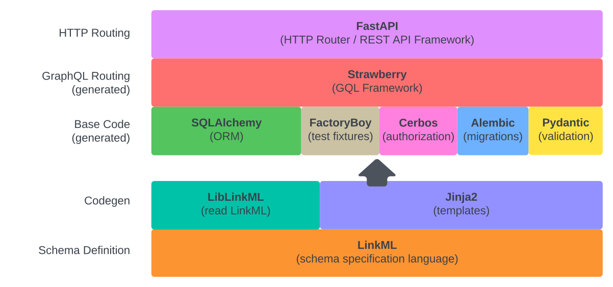

# Platformics

Platformics is a GraphQL API framework that relies on code generation to implement a full featured GraphQL API on top of a PostgreSQL database, with support for authorization policy enforcement and file persistence via S3. It's built on top of the best available Python tools and frameworks!

The libraries and tools that make Platformics work:

 
### Links to these tools/libraries
 - [LinkML](https://linkml.io/) - Schema modeling language
 - [FastAPI](https://fastapi.tiangolo.com/) - Async HTTP router
 - [Strawberry](https://strawberry.rocks/) - GraphQL Framework
 - [Pydantic](https://docs.pydantic.dev/latest/) - Data validation
 - [Cerbos](https://www.cerbos.dev/) - Authorization
 - [SQLAlchemy](https://www.sqlalchemy.org/) - Database Access / ORM
 - [factory_boy](https://factoryboy.readthedocs.io/en/stable/) - Test fixtures
 - [Alembic](https://alembic.sqlalchemy.org/en/latest/) - Database migrations

## Current Features
- [x] Express your schema in a straightforward YAML format
- [x] GraphQL Dataloader pattern (no n+1 queries!)
- [x] Authorization policy enforcement
- [x] Flexible Filtering
- [x] Data aggregation
- [x] Top-level pagination
- [x] Relationship traversal
- [x] DB migrations
- [x] Generated Test fixtures
- [x] pytest wiring
- [x] VSCode debugger integration
- [x] Authorized S3 file up/downloads
- [x] Add custom REST endpoints to generated API
- [x] Add custom GQL queries/mutations to generated API

## Roadmap
- [ ] Plugin hooks to add business logic to generated GQL resolvers
- [ ] Support arbitrary class inheritance hierarchies
- [ ] Package and publish to PyPI

## How to set up your own platformics API
1. Copy the test_app boilerplate code to your own repository.
2. Edit `schema/schema.yml` to reflect your application's data model.
3. Run `make build` and then `make init` to build and run your own GraphQL API service.
4. Browse to http://localhost:9009/graphql to interact with your api!
5. Run `make token` to generate an authorization token that you can use to interact with the API. The `make` target copies the necessary headers to the system clipboard. Paste the token into the `headers` section at the bottom of the GraphQL explorer API

## Versioning platformics
Platformics can be used in downstream applications by 
1) using the platformics image as the base Docker image. To select a version of platformics, add the appropriate version tags to the docker image
2) installing as a dependency, `pip install platformics`.

The version in `pyproject.toml` is managed using [poetry-dynamic-versioning](https://pypi.org/project/poetry-dynamic-versioning/) which determines version based on git tags.

## Iterating on your schema
1. Make changes to `schema/schema.yml`
2. Run `make codegen` to re-run code gen and restart the API service
3. If your changes require DB schema changes, run `make alembic-autogenerate` and `make alembic-upgrade-head` to generate DB migrations and run them.

## HOWTO
- [Work with platformics](docs/HOWTO-working-with-platformics.md)
- [Extend the generated API](docs/HOWTO-extend-generated-api.md)
- [Customize Codegen templates](docs/HOWTO-customize-templates.md)

## Contributing
This project adheres to the Contributor Covenant code of conduct. By participating, you are expected to uphold this code. Please report unacceptable behavior to opensource@chanzuckerberg.com.

## Reporting Security Issues
Please disclose security issues responsibly by contacting security@chanzuckerberg.com.
